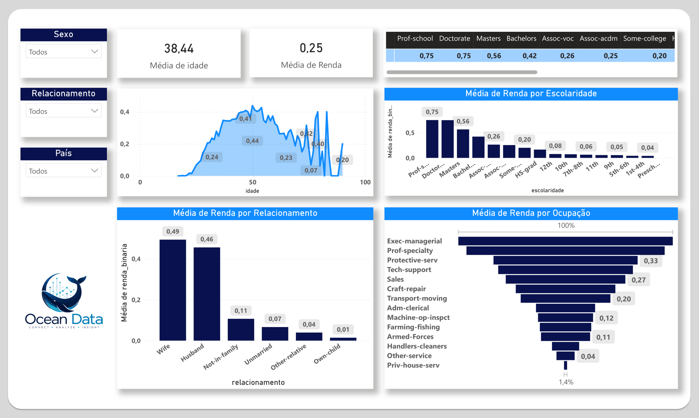
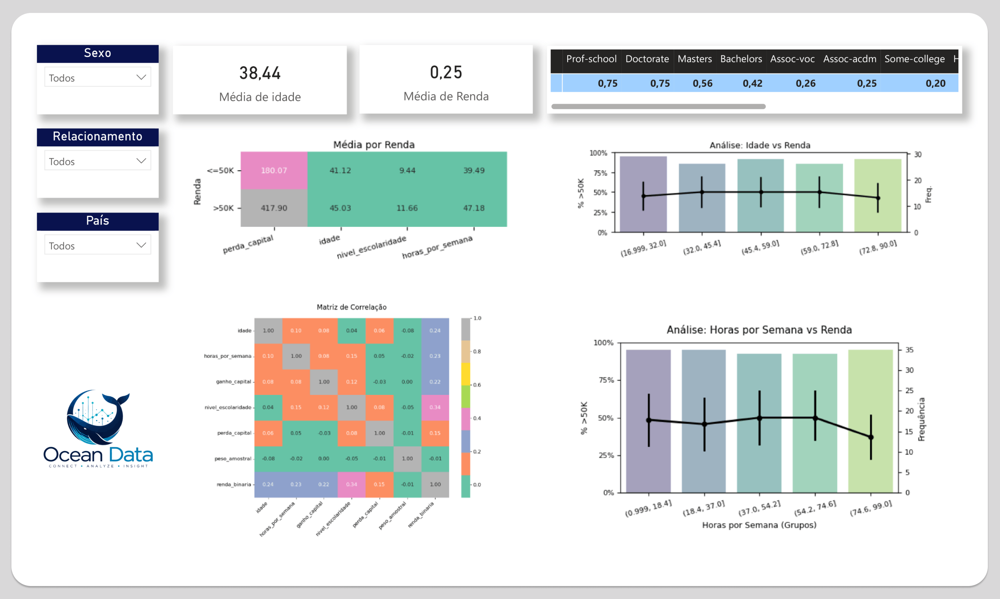
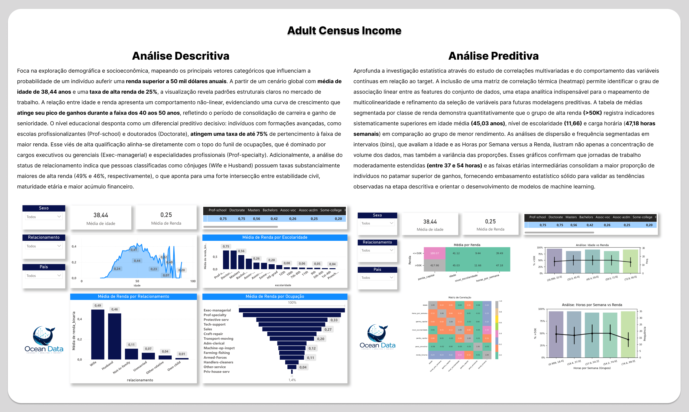
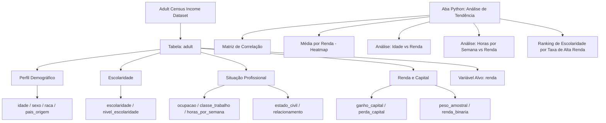

# 🧮 Adult Census Income | Análise de Renda & Perfil Socioeconômico


> Análise socioeconômica desenvolvida no Power BI com suporte de Python para identificar os fatores que determinam se uma pessoa aufere renda superior a $50K anuais. O projeto combina visualizações interativas no Power BI com uma aba dedicada de análise estatística em Python, cobrindo variáveis como escolaridade, ocupação, jornada de trabalho, estado civil e perfil demográfico.

---

## 📊 Acesse o Dashboard Interativo

Para navegar pelas páginas, utilizar os filtros e explorar os indicadores dinamicamente, acesse a versão publicada no Power BI Web:

[](https://app.powerbi.com/view?r=eyJrIjoiYmZhZDQyYjQtYTNkNC00OTkzLThiZWMtNGI4YmFhMWMyNjA5IiwidCI6IjkwN2IxZDhiLTE2ZTEtNDZiZi05ODczLTI3MjNmNTlmODcwYSJ9)

---

## 🖼️ Visão Geral do Projeto

<div align="center">

### Dashboard

| | |
|:---:|:---:|
|  |  |
|  |  |

### Análise de Tendência (Python)

| | |
|:---:|:---:|
|  |  |

</div>

---

## 💡 Principais Insights Analíticos

A análise dos **30.162 registros** do censo americano revelou os principais fatores associados à renda superior a $50K anuais:

🎓 **Escolaridade é o fator de maior correlação com alta renda:** Apenas **11,4% dos indivíduos** com ensino médio (`HS-grad`) ganham acima de $50K, enquanto esse percentual sobe para **74,9% entre doutores** (`Doctorate`) e **75,0% entre profissionais com Prof-school** — mais de 6x a taxa dos menos escolarizados.

👔 **Executivos e especialistas lideram em renda:** As ocupações `Exec-managerial` e `Prof-specialty` concentram juntas mais de **3.748 indivíduos** com renda acima de $50K, representando cerca de **50% de todos os casos de alta renda**, mesmo sendo apenas 26% da força de trabalho.

💍 **Estado civil casado é forte preditor de alta renda:** Indivíduos com `Married-civ-spouse` representam **85,2% de todos os casos de renda >$50K**, com taxa de alta renda de **45,5%** — contra apenas **4,8% entre os solteiros** (`Never-married`).

👨 **Homens ganham acima de $50K em proporção muito maior:** Dos 20.380 homens no dataset, **31,4% têm renda >$50K**, enquanto entre as 9.782 mulheres esse percentual cai para **11,4%** — uma diferença de 2,7x.

🏢 **Autônomos incorporados têm a maior taxa de alta renda por setor:** O grupo `Self-emp-inc` apresenta **55,9% de renda >$50K**, superando até o setor federal (38,7%) e estadual (26,9%). O setor privado, apesar de majoritário com 22.286 pessoas, tem taxa de apenas **21,9%**.

⏱️ **Jornada de trabalho influencia a renda, mas não linearmente:** A média de horas semanais é de **40,9h** para toda a amostra. A análise de tendência em Python mostra que a proporção de renda >$50K cresce até faixas intermediárias de horas trabalhadas, mas se estabiliza nas jornadas mais longas.

🌍 **91,2% dos registros são de residentes nos EUA:** Com 27.504 entradas, os Estados Unidos dominam o dataset. O segundo país com mais representantes é o México (610), reforçando o caráter fortemente americano dos dados.

📊 **A matriz de correlação (Python) revela dependências sutis:** As variáveis `renda_binaria` e `nivel_escolaridade` apresentam correlação de **0,34**, enquanto `horas_por_semana` tem correlação de **0,23** com a renda — indicando que escolaridade tem peso relativo maior que a jornada no modelo.

---

## 📈 Resumo de KPIs

| Métrica | Valor | Métrica | Valor |
|---|---:|---|---:|
| 👥 **Total de Registros** | 30.162 | 📉 **Renda ≤ $50K** | 22.654 (75,1%) |
| 💰 **Renda > $50K** | 7.508 (24,9%) | 🎂 **Idade Média** | 38,4 anos |
| ⏱️ **Horas Semanais (média)** | 40,9h | 🌍 **Países de Origem** | 41 |
| 👨 **Homens** | 20.380 (67,6%) | 👩 **Mulheres** | 9.782 (32,4%) |

---

## ⚙️ Arquitetura do Modelo Semântico

O projeto utiliza um modelo **flat** com uma única tabela de dados, dada a natureza tabular do censo. A aba de **Análise de Tendência** foi desenvolvida inteiramente em **Python** diretamente no Power BI, gerando visualizações estatísticas avançadas como matriz de correlação e gráficos de barras com intervalos de confiança.



---

## 🐍 Aba de Análise de Tendência — Python

Uma das páginas do dashboard foi desenvolvida inteiramente com **Python integrado ao Power BI**, entregando análises estatísticas que vão além dos visuais nativos da ferramenta.

### Visualizações geradas em Python

| Visual | Descrição |
|---|---|
| **Matriz de Correlação** | Heatmap com os coeficientes de correlação entre todas as variáveis numéricas (`idade`, `horas_por_semana`, `ganho_capital`, `perda_capital`, `nivel_escolaridade`, `peso_amostral`, `renda_binaria`) |
| **Média por Renda (Heatmap)** | Tabela de calor comparando as médias de `perda_capital`, `idade`, `nivel_escolaridade` e `horas_por_semana` entre os grupos `<=50K` e `>50K` |
| **Análise: Idade vs Renda** | Gráfico de barras agrupadas por faixa etária com a proporção de renda >50K (eixo esquerdo) e frequência de observações (eixo direito), com intervalo de confiança |
| **Análise: Horas por Semana vs Renda** | Mesmo padrão do gráfico anterior, segmentado por faixas de horas trabalhadas semanalmente |
| **Ranking de Escolaridade** | Tabela ordenada pela taxa de alta renda por nível de escolaridade, de Prof-school (0,75) até níveis mais baixos |

### Bibliotecas Python utilizadas

```python
import pandas as pd
import matplotlib.pyplot as plt
import seaborn as sns
import numpy as np
```

---

## 🗂️ Dicionário de Dados

### Tabela: adult

**Perfil Demográfico**

| Coluna | Tipo | Descrição |
|---|---|---|
| `idade` | Int | Idade do indivíduo |
| `sexo` | String | Gênero (Male / Female) |
| `raca` | String | Raça/etnia (White, Black, Asian-Pac-Islander, Other, Amer-Indian-Eskimo) |
| `pais_origem` | String | País de origem (41 países representados) |
| `relacionamento` | String | Papel no núcleo familiar (Wife, Husband, Not-in-family etc.) |
| `estado_civil` | String | Estado civil (Married-civ-spouse, Never-married, Divorced etc.) |

**Escolaridade**

| Coluna | Tipo | Descrição |
|---|---|---|
| `escolaridade` | String | Nível de escolaridade categórico (HS-grad, Bachelors, Masters, Doctorate etc.) |
| `nivel_escolaridade` | Int | Equivalente numérico da escolaridade (1 a 16) |

**Situação Profissional**

| Coluna | Tipo | Descrição |
|---|---|---|
| `ocupacao` | String | Cargo/ocupação (Exec-managerial, Prof-specialty, Sales, Craft-repair etc.) |
| `classe_trabalho` | String | Setor de trabalho (Private, Self-emp-inc, Federal-gov, State-gov etc.) |
| `horas_por_semana` | Int | Horas trabalhadas por semana |

**Renda e Capital**

| Coluna | Tipo | Descrição |
|---|---|---|
| `ganho_capital` | Int | Ganho de capital no período |
| `perda_capital` | Int | Perda de capital no período |
| `peso_amostral` | Int | Peso amostral do censo (número de pessoas representadas pelo registro) |
| `renda` | String | Classe de renda anual (`<=50K` ou `>50K`) — variável alvo |
| `renda_binaria` | Int | Codificação binária da renda (0 = ≤$50K, 1 = >$50K) |

---

## 🛠️ Ferramentas e Tecnologias

| Ferramenta | Uso |
|---|---|
| **Power BI Desktop** | Modelagem de dados, desenvolvimento dos visuais interativos e integração com Python |
| **Python (no Power BI)** | Geração de visualizações estatísticas avançadas na aba de Análise de Tendência |
| **Matplotlib / Seaborn** | Criação da matriz de correlação, heatmaps e gráficos de barras com IC |
| **Power Query (M)** | Tratamento e limpeza dos dados brutos do CSV |
| **Kaggle** | Fonte do dataset público Adult Census Income |

---

## 📦 Sobre o Dataset

O **Adult Census Income** (também conhecido como "Adult Dataset") é extraído do banco de dados do Censo Americano de 1994, amplamente utilizado como benchmark em machine learning para tarefas de classificação binária.

| Informação | Detalhe |
|---|---|
| 📋 Total de registros | 30.162 |
| 📊 Colunas | 16 (14 originais + 2 calculadas) |
| 🎯 Variável alvo | `renda` (<=50K ou >50K) |
| 📉 Proporção de renda >50K | 24,9% |
| 🌍 Países representados | 41 |
| 📅 Origem | Censo Americano 1994 (UCI Machine Learning Repository) |
| 🔗 Fonte | [Kaggle — Adult Census Income](https://www.kaggle.com/datasets/uciml/adult-census-income) |

---

## 👤 Autor

Feito por **Italo Silva**

[](https://www.linkedin.com/in/italo-silva)
[](https://github.com/italo-silva)

---

## 📄 Licença

Dataset original disponibilizado pelo UCI Machine Learning Repository via Kaggle para uso educacional.
Este projeto (análise e dashboard) é de uso livre para fins educacionais e de portfólio.
